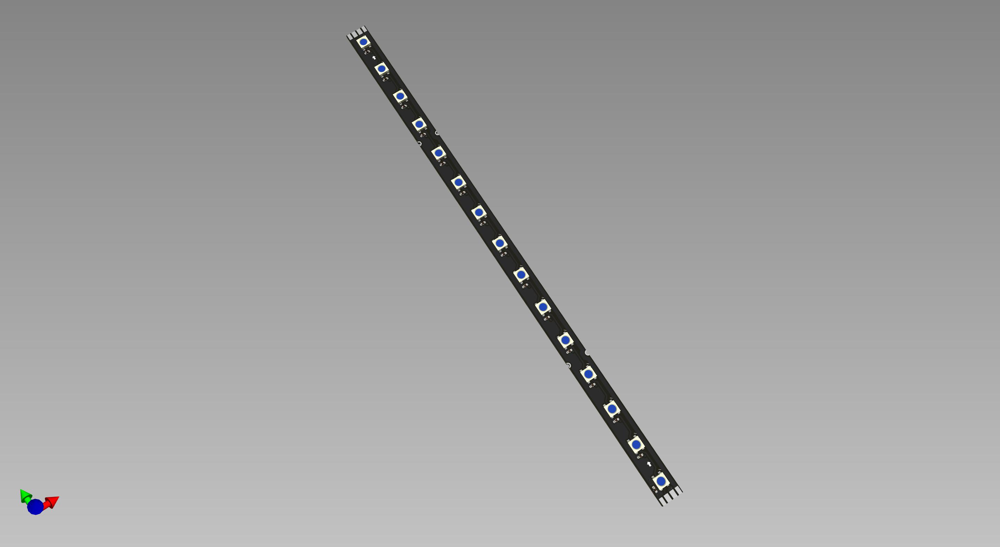
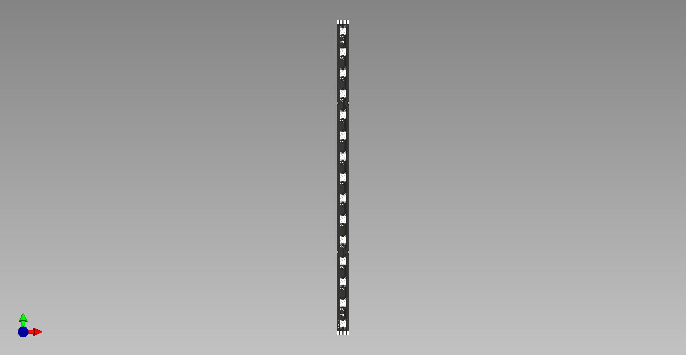
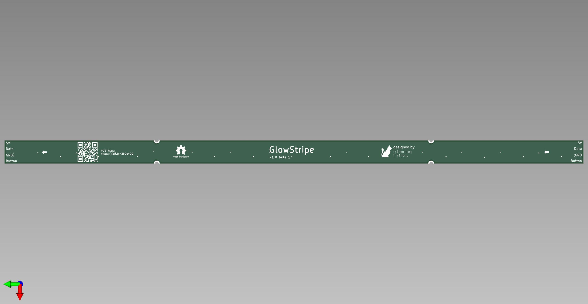

# GlowStripe PCB

## What is this project?

A stable LED stripe PCB with a separate trace for a button.

## Links

- [Schematic](https://github.com/glowingkitty/GlowStripe/blob/main/GlowLEDsPCB.pdf)
- [Interactive BOM](https://htmlpreview.github.io/?https://github.com/glowingkitty/GlowStripe/blob/main/bom/ibom.html)
- [PCB stencils](https://github.com/glowingkitty/GlowStripe/tree/main/PCB%20stencils)