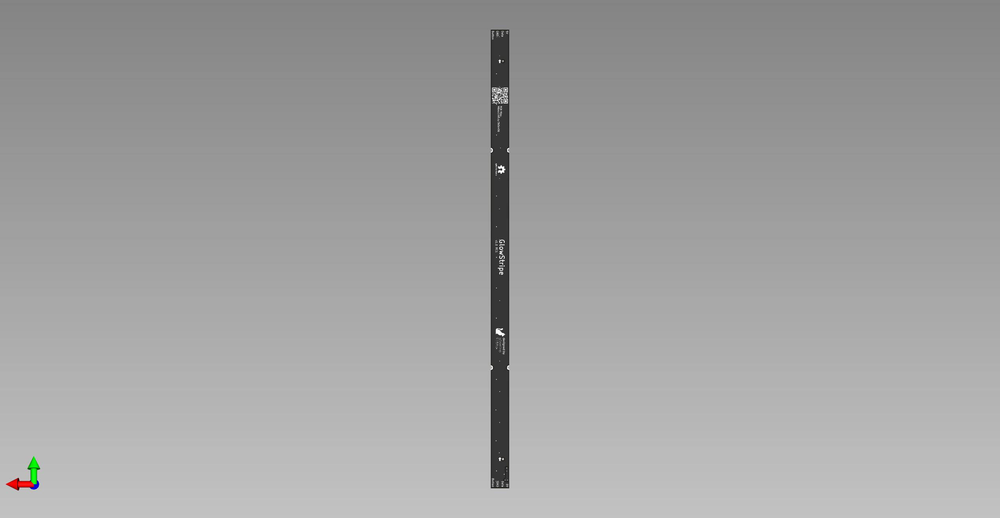

# GlowStripe PCB

## Warning:

This project is currently under active development and has not been fully tested yet. If you decide to build or clone the project, be aware the project might not work yet as expected. Use at your own risk.

## What is this project?

A stable LED stripe PCB with a separate trace for a button.

## Links

- [Schematic](https://github.com/glowingkitty/GlowStripe/blob/main/GlowLEDsPCB.pdf)
- [Interactive BOM](https://htmlpreview.github.io/?https://github.com/glowingkitty/GlowStripe/blob/main/bom/ibom.html)
- [PCB stencils](https://github.com/glowingkitty/GlowStripe/tree/main/PCB%20stencils)